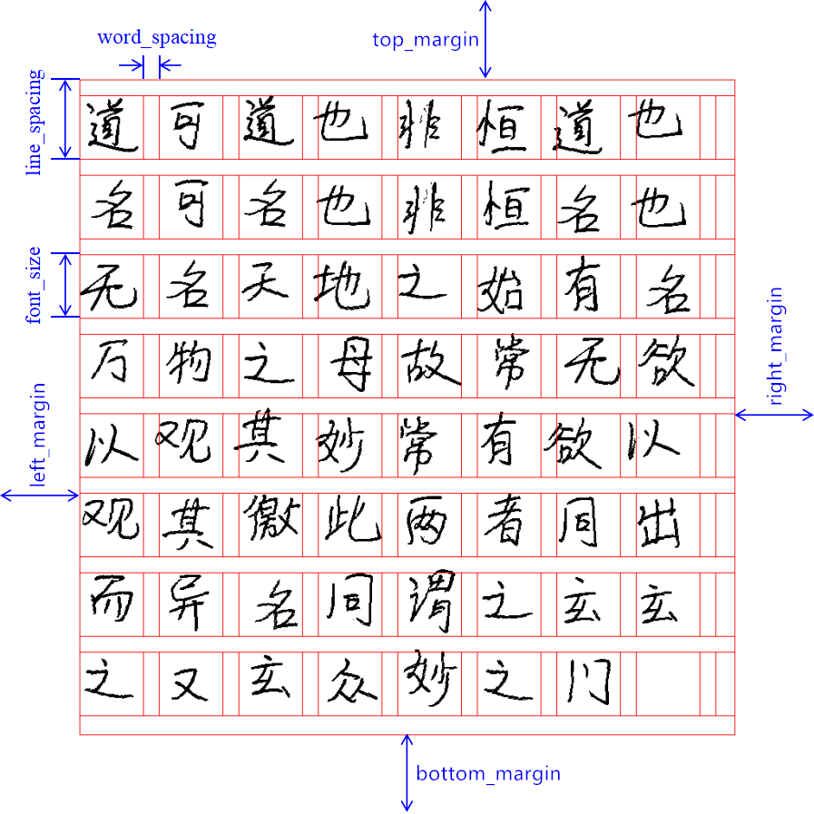

# Tutorial
本文讲述如何生成并打印出足以媲美真人手写的文档。

### 一个详细的示例
```python
# coding: utf-8
from PIL import Image, ImageFont

from handright import Template, handwrite

text = """
窗前明月光
疑是地上霜
举头望明月
低头思故乡
"""

template = Template(
    background=Image.new(mode="1", size=(900, 1000), color=1),
    font_size=100,
    font=ImageFont.truetype("path/to/my/font.ttf"),
    line_spacing=150,
    fill=0,  # 字体“颜色”
    left_margin=100,
    top_margin=100,
    right_margin=100,
    bottom_margin=100,
    word_spacing=15,
    line_spacing_sigma=6,  # 行间距随机扰动
    font_size_sigma=20,  # 字体大小随机扰动
    word_spacing_sigma=3,  # 字间距随机扰动
    end_chars="，。",  # 防止特定字符因排版算法的自动换行而出现在行首
    perturb_x_sigma=4,  # 笔画横向偏移随机扰动
    perturb_y_sigma=4,  # 笔画纵向偏移随机扰动
    perturb_theta_sigma=0.05,  # 笔画旋转偏移随机扰动
)
images = handwrite(text, template)
for i, im in enumerate(images):
    assert isinstance(im, Image.Image)
    im.show()
    im.save("path/to/my/output/{}.webp".format(i))
```
从上述示例可以看出，**Handright**建立于[Pillow](https://github.com/python-pillow/Pillow)库之上，`handwrite`作为最核心的函数实现了模拟手写的功能，而`Template`是与其相配套的参数类；`handwrite`的返回值为一个[Pillow](https://github.com/python-pillow/Pillow) `Image`的`Iterable`，您可以将这些`Image`展示、保存或者对其做进一步的图像处理。


### API文档
您可以使用[Pydoc](https://docs.python.org/3/library/pydoc.html)来查阅**Handright**的API文档。

### 排版参数关系图


### 字体大小（font_size）
为了发挥出Handright的优异效果，您需要设置较大的字体大小。往往设置越大的字体大小，生成的字形越平滑，锯齿越少。但是越大的字体大小往往需要越大的背景图片，计算量和内存占用也就越大。推荐从`80`开始尝试。

### 字体填充（fill）
强烈建议若无特殊需要不要使用除纯黑外的其它颜色。黑色是打印机中最常见的颜色，它有对应颜色的墨水。而灰色和除个别颜色外的彩色都是需要多种颜色墨水和背景的白色调和形成的。

### 字体（font）
推荐使用的字体本身也是仿手写的字体。

### 背景（background）
因为新版本需要设置较大的字体大小，所以舞台（背景图片）也要更大。

如果您使用空背景，可以使用Pillow生成合适大小的背景，对于黑白打印
```python
from PIL import Image
background = Image.new(mode="1", size=(2048, 2048), color=1)
```
如果字体为灰色，`mode`可改为`"L"`。如果字体为彩色，`mode`可改为`CMYK`。

然而，大多数情况下我们使用的是自定义背景。往往我们要用的背景图片又不够大，此时我们需要对图片做适当的放大处理。
```python
width, height = background.size
background = background.resize(
    (width * 2, height * 2), resample=Image.LANCZOS
)
```
另外，如果您使用的是彩色背景，但最终又是黑白打印，推荐将背景图片提前转换为灰度图片以减少计算开销。
```python
background = background.convert(mode="L")
```

### 字间距（word_spacing）
有时，即使`word_spacing == 0`也会遇到字间距不够小的情况。此时，您可以将`word_spacing`设为负数以使得字间距更小。

### 随机参数（*_sigma)
虽然上述随机参数是可选参数，但是仍建议您不要使用默认值，而是根据所需模仿手写特点设置合适的值。

### 并行加速（mapper)
`mapper`是在页面渲染过程中使用的映射函数。其默认使用内置的`map`函数。您可以将其更换为其它更高效的实现，例如：
```python
from multiprocessing import Pool

from handright import *

if __name__ == "__main__":
    text = "我能吞下玻璃而不伤身体。"
    template = ...
    with Pool() as p:
        images = handwrite(text, template, mapper=p.map)
    ...

```
